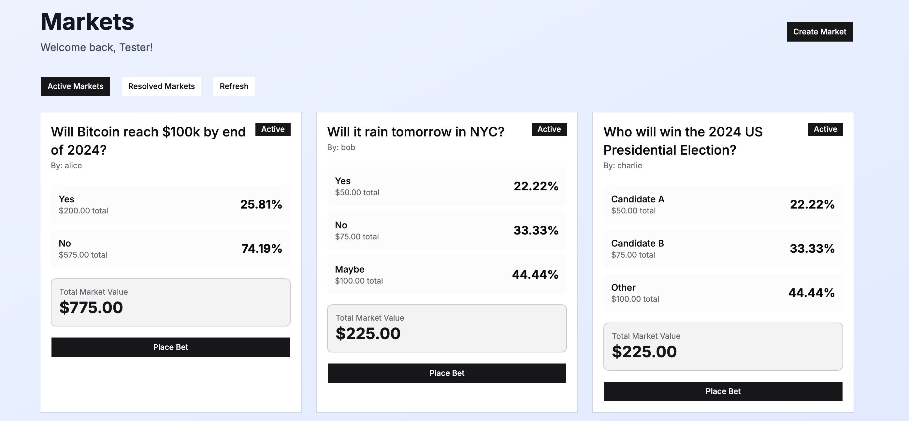

# Themeisle Internship Test for 2026

## Introduction

This is the challenge for the Themeisle Internship Test for 2026. The goal of this test is to evaluate your skills in creating a software product.

Since we are a web company, the challenge will be in creating a web application; and main subject of it will be a simple prediction market. The application should allow users to create and participate in prediction markets on various topics. Users should be able to create markets, place bets, and view the outcomes of the markets.

The requirements have been crafted to be as close as possible to the tasks and workflows we encounter on a daily basis. If you enjoyed solving this challenge, you might find the work during the internship interesting as well.

#### _Why a prediction markets web app?_

With the popular rise of platforms like Polymarket and Kalshi, we thought it would be an interesting challenge compared to the usual ones like building a to-do list, weather app, or a blog.

We need to keep in mind that the current LLM models are very powerful, thus the challenge might be overwhelming at first glance. However, we encourage you to break down the problem into smaller, manageable tasks. The test is made around basic idea of web development, so there will be no need to implement complex algorithms. Focus on creating a functional and user-friendly application that meets the requirements.

### Deadline

The submission deadline for this test is **11:59 PM on April 17, 2026**. Please make sure to submit your application before the deadline to be considered for the internship.

For the review, we will try to review it shortly after you submit the solution, based on our availability.

### I do not know web development, can I still do the test?

Yes. With the rise of AI tools, the entry barrier for web development is much lower than before. You can use AI tools to assist you in the development process.

### Usage of AI tools

We strongly encourage you to leverage AI tools to assist you in the development process. You can use AI tools for code generation, debugging, and even for brainstorming ideas. However, we expect you to be able to explain your solution and the choices you made during the development process.

At the end of the day, this test will represent your idea of a software product regardless of the tools you used to create it.

## Evaluation Criteria

Your submission will be evaluated based on the following criteria:
1. **Functionality**: Does the application meet the requirements? Can users create markets, place bets, and view outcomes?
2. **User Experience**: Is the application user-friendly and visually appealing? (Since this is a subjective criterion, we will not expect you to be a designer, but we will look for a clean and intuitive interface that respects best practices of UI/UX design and is not hostile to the user).
3. **Code Quality**: You may generate the code using AI tools, but code is a liability in itself, so ask yourself if you would be able to maintain it in the future.

### Submission Guidelines

(REQUIRED STEP) Once you finish your application, in the `./submission` folder, please include a video demo or images showcasing the functionality of your application, along with a brief write-up explaining your design choices and any challenges you faced during development.

Few observations:
 - If the video cannot be included in the submission because of size restriction on the Git platform, you can upload it to a video hosting platform (like Google Drive) and include the link in the write-up (make sure that video link is public so that we can access it).
 - Make sure that if you make last minute changes to the UI, you update the video or images in the submission folder to reflect those changes.
 
 Once everything is done, please submit the repository link on our platform at https://careers.vertistudio.com/jobs/ELu-Mzlbsl93/junior-software-developer-internship-2026 (Please use the same email adress that you used on https://stagiipebune.ro/ | **Our contact email is also displayed on that page.**). We will review your submission and get back to you with feedback.

## Story

 A little story to set the mood for the challenge.

### Two founders

Hank and John are old friends who go way back to their college days. While Hank was always more interested in the business side of things, John was the tech-savvy one.

While doom-scrolling on X, Hank saw the rise of prediction markets and thought it would be a great business opportunity. He immediately called John and pitched the idea to him. John was intrigued by the idea and agreed to work on it with Hank.

While working on the project, the rise of LLM tools started to revolutionize the way software is developed. Hank was excited about those new tools that will make John work faster. But this view was not shared by John.

#### The end of programming?

John was very sad about the rise of LLM tools. He felt that his skills as a programmer were becoming obsolete. He was worried about his future and the future of programming in general. So he decided to quit programming and become a farmer.

After hearing the news, Hank was devastated. Ok, the AI can write code, but this does not mean that he can now be the one responsible for the product. Someone must take the responsibility of the product.

#### The product owner

In the search for a product owner, Hank came across your profile and thought that you would be a great fit for the role. He reached out to you and explained the situation.

Here are the things that John managed to do before quitting programming:
- He created a basic wireframe of the application.
- He set up the project structure and created a basic backend API.
- He implemented the basic functionality for creating markets and placing bets.
- He created a basic frontend interface for the application.

Now, Hank needs you to take over the project and finish it.

## Task

Hank has a list of features that he wants to see in the final product:

### 1. Main Dashboard
- Display all active markets, each showing its title, outcomes, current odds, and total bet amount.
- Allow sorting by creation date, total bet size, or number of participants.
- Allow filtering by market status (e.g., active, resolved).
- Display 20 markets per page with next/previous navigation.
- Update market odds and bet totals in real-time without requiring a page refresh.

### 2. User Profile Page
- Display the user's resolved bets, showing the market title, the outcome they bet on, and whether they won or lost.
- Display the user's current active bets with their current odds, updated in real-time.
- Paginate each list separately (20 items per page).

### 3. Market Detail Page
- Display a chart showing the percentage of total bets placed on each outcome.
- Display the current odds for each outcome.
- Allow the user to select an outcome and place a bet with a specified amount.
- Validate that the bet amount is a positive number before submission.

### 4. Leaderboard
- Rank users by their total winnings in descending order.
- Display each user's name and total winnings.

### 5. Role System
- We need an admin with the power to resolve a bet.
- The dashboard and bets will show a modified version that allows an admin to set an outcome for a bet.

### 6. Admin Market Resolution
- Mark a market as resolved with winning outcome
- Archive a market and distribute the remaining funds back to the bettor(s)
- Requires admin authentication

### 7. Payout Distribution
- Calculate winners (bets matching the resolved outcome)
- Distribute total bet pool to winners proportionally by their stake
- Update user balances accordingly

### 8. User Balance Tracking
- Users start with initial balance (e.g., 1000)
- Deduct bet amount when placing bet
- Add winnings when market resolves

### Cross-cutting requirements
- **Real-time updates**: The dashboard and user profile should reflect new bets and odds changes within a few seconds, without requiring a page refresh.
- **Pagination**: Any list that can grow unbounded must be paginated (20 items per page with next/previous navigation).

### Bonus Task

> This task is not mandatory, but it will be a great addition.

Hank also thinks that the users will want to use bots to place bets, so the app will need to have an API that allows users to place bets programmatically. So users should be able to generate an API key from their profile page and use it to place bets using the API. So the backend will need to have endpoints similar to the ones in the frontend that allow users to:
- Create markets
- List markets
- Place bets
- View outcomes

Hint: Think if you can reuse the same endpoints for both the frontend and the API, this will make your life easier and will also make the application more consistent.

## Other Clarifications

- **You’re free to change the UI.** Feel welcome to customize the existing interface to match your style, or simply keep it as-is and continue building on top of it.

- **No extra services are required.** This challenge can be completed without additional infrastructure such as Redis or MongoDB. If you *do* decide to add services, please include them via **Docker Compose** and make sure the project can be started easily.

- **Keep the project easy to run.** We’ll review both the code and how the application behaves, so please provide clear, minimal steps to spin up the project (e.g., `README` instructions on `./submission` and/or `docker compose up`). Review time is limited, so straightforward setup will help us evaluate your submission fairly.

- **Backend stack is flexible, within reason.** The provided backend uses **Bun + Elysia**. You may switch to another backend/framework (e.g., Laravel), but if you do, we recommend using **Docker Compose** for the setup. In general, we encourage sticking to the provided stack or a widely used, well-documented framework.

> If you still haven’t submitted a solution, we recommend taking a look at this section from time to time, as it may be updated if issues recur.

### How to start

1. Make sure that project is running locally on your machine. The Bun runtime is cross-platform, so you should be able to run it on any operating system. If you encounter any issues, you can also switch the runtime to Node.js, but make sure to remove the Bun-specific code and dependencies.
2. Try to analyze similar products like Polymarket and Kalshi to get a better understanding of the features and functionalities that you need to implement. Since this is a simple project, do not overcomplicate things by adding features that are not necessary.
3. Think first as an user. You may write great code, or use the fanciest libraries, but the people who will use it will not care. They just want to bet and your bugs or UX idea should not get in the way of that.

### Recommended Reading

Before diving into the code, we recommend familiarizing yourself with the following topics:

- **REST API design** — How to structure endpoints, use HTTP methods (GET, POST, PUT, DELETE), and return appropriate status codes.
- **Error handling in web applications** — How to handle errors gracefully on both the client and server. Display user-friendly error messages instead of crashing or showing raw errors.
- **Form validation** — Validate user input on both the client (for instant feedback) and the server (for security). Never trust data coming from the frontend.
- **Pagination patterns** — Offset-based vs. cursor-based pagination and when to use each.
- **Real-time updates** — Understand the difference between polling, WebSockets, and Server-Sent Events (SSE), and when each is appropriate.
- **UI/UX best practices** — Loading states, empty states, confirmation dialogs for destructive actions, and responsive design.
- **Database design basics** — Primary keys, foreign keys, indexes, and why they matter for query performance.
- **Authentication basics** — Sessions vs. tokens, password hashing, and protecting routes from unauthorized access.
